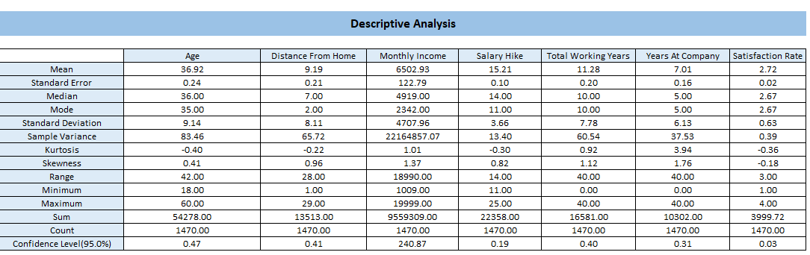
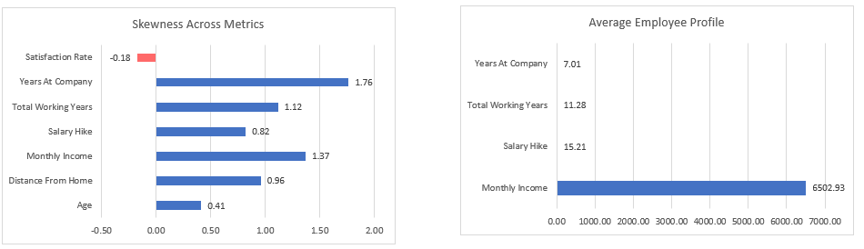
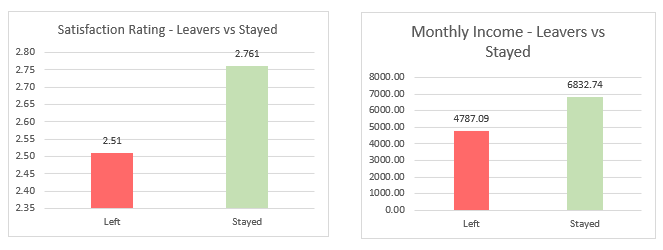
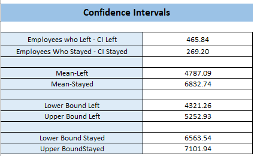
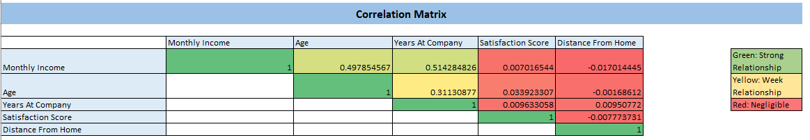
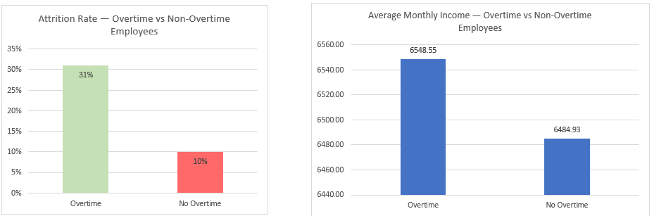
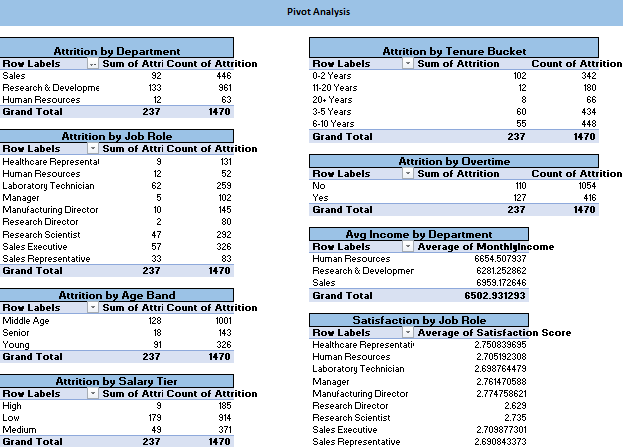
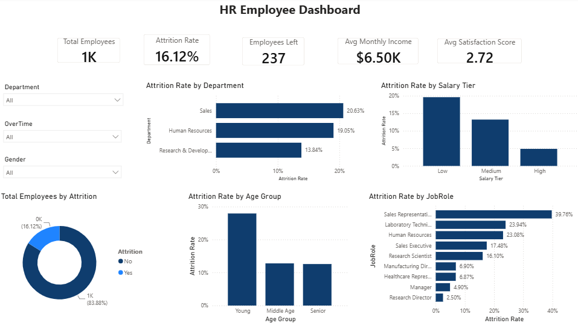
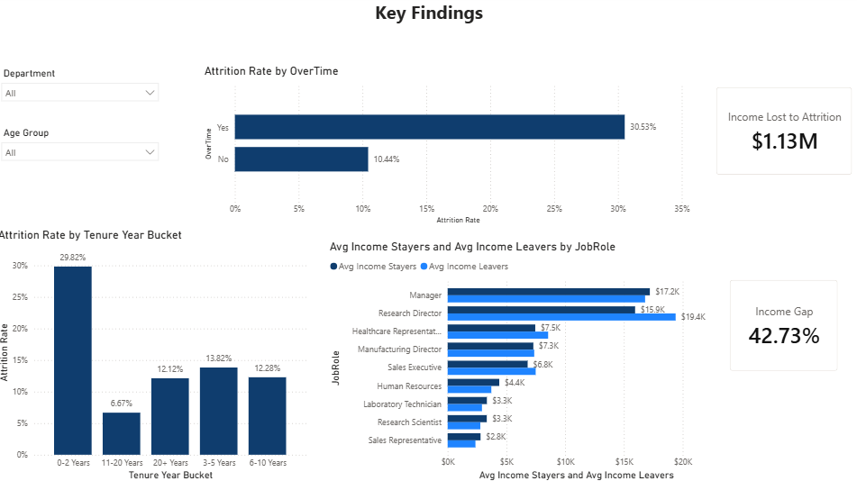

# HR Analytics: Employee Attrition & Performance
### Excel · DAX · Power BI 


---


## Business Context

Losing an employee costs a company far more than the empty seat — recruiting, onboarding, ramp-up time, and lost productivity all add up. IBM's HR Analytics dataset simulates exactly this problem: a workforce of 1,470 employees, 16% of whom have left the company. HR and business leaders need to know *who* is leaving, *why*, and *how much it's costing* before they can act on it.

This project treats the dataset like a real HR analytics request: clean the raw export, validate the "obvious" drivers of attrition statistically instead of assuming them, and hand leadership a dashboard they can filter and act on.

## Problem Statement

- What is the company's overall attrition rate, and which departments, job roles, and salary tiers are hit hardest?
- Is attrition really linked to income and satisfaction, or is that just intuition?
- Does overtime actually drive people to leave — and if so, is the company even compensating for it?
- How much income (payroll investment) is walking out the door because of attrition?


---


## Dataset and Tools

| Stage | Tools |
|---|---|
| **Dataset** | [IBM HR Analytics Employee Attrition & Performance](https://www.kaggle.com/datasets/pavansubhasht/ibm-hr-analytics-attrition-dataset) |
| **Sample Size** | 1,470 rows, 35 columns |
| **Tools** | Excel (formulas, statistical testing, pivot tables) → Power BI (DAX, interactive dashboard) |


---


## Table of Contents

1. [Data Cleaning](#1-data-cleaning)
2. [Excel Analysis](#2-excel-analysis) </br>
   1.[Descriptive Analysis](#1-descriptive-analysis)  </br>
   2.[T-Test Analysis](#2-t-test-analysis)  </br>
   3.[Confidence Intervals](#3-confidence-intervals)  </br>
   4.[Correlation Matrix](#4-correlation-matrix)  </br>
   5.[A/B Testing](#5-a/b-testing)  </br>
   6.[Pivot Analysis](#6-pivot-analysis)
4. [Power BI Dashboard](#3-power-bi-dashboard)
5. [Key Findings](#4-key-findings)
6. [Recommendations](#5-recommendations)

---

## 1.  Data Cleaning

Raw HR exports usually carry columns that look like data but carry zero analytical value — constants, duplicated flags, IDs. Leaving them in bloats the model, can skew correlation/variance calculations if accidentally swept into a range, and signals sloppy QA to anyone reviewing the workbook. I cleaned first so every downstream formula and DAX measure runs against a lean, purpose-built table rather than the raw 35-column dump.

Working from the raw 1,470 × 35 export, I dropped and derived columns before analysis:

**Removed (zero information value):**
- `EmployeeCount` — every row = 1
- `Over18` — every row = "Y" / "Yes"
- `StandardHours` — every row = 80

**Derived columns added:**

| Column | Purpose |
|---|---|
| `Age Group` | `Age` recoded less than 30 as Young, 30-50 as Middle Age and greater than 50 as Senior  |
| `Attrition (Numeric)` | `Attrition` recoded Yes = 1, No = 0, for use in formulas/DAX |
| `Overtime (Numeric)` | `Overtime` recoded Yes = 1, No = 0, for use in formulas/DAX |
| `Tenure Year Bucket` | Average of Environment, Job, and Relationship satisfaction |
| `Total Satisfaction Score` | `YearsAtCompany` recorded as 0-2 Years, 3-5 Years, 6-10 Years, 11-20 Years and 20+ Years |
| `Income Left` / `Income Stayed` | Monthly income split by attrition status, for t-tests |
| `Satisfaction Left` / `Satisfaction Stayed` | Satisfaction score split by attrition status |
| `Income OT Yes` / `Income OT No` | Monthly income split by overtime status |
| `Attrition OT Yes` / `Attrition OT No` | Attrition flag split by overtime status |


```excel
Age Group                = =IFS([Age]<30,"Young",[Age]<=50,"Middle Age",[Age]>50,"Senior")
Attrition (Numeric)      = IF([Attrition]="Yes", 1, 0)
Overtime (Numeric)      = IF([Overtime]="Yes", 1, 0)
Tenure Year Bucket      = IFS( [YearsAtCompany] <= 2, "0-2 Years", [YearsAtCompany] <= 5, "3-5 Years",
                               [YearsAtCompany] <= 10, "6-10 Years", [YearsAtCompany] <= 20, "11-20 Years",
                               [YearsAtCompany] > 20,"20+ Years")
Total Satisfaction Score = AVERAGE([@EnvironmentSatisfaction], [@JobSatisfaction], [@RelationshipSatisfaction])
Income Left               = IF([Attrition]="Yes", [MonthlyIncome], "")
Income Stayed             = IF([Attrition]="No",  [MonthlyIncome], "")
Income OT Yes              = IF([OverTime]="Yes", [MonthlyIncome], "")
Income OT No                = IF([OverTime]="No",  [MonthlyIncome], "")
```


**Workbook structure:**


---

## 2.  Excel Analysis

### 1. Descriptive Statistics

Before testing any hypothesis about attrition, I needed to know what "normal" looks like for this workforce — the typical income, tenure, and satisfaction level, and whether those distributions are symmetric or skewed. Skipping this step is how people misread a mean pulled by outliers as "the typical employee." Skewness and kurtosis specifically tell me whether it's safe to trust the mean at face value or whether the median is the more honest summary — which directly shapes how I read every chart that follows.

Computed with native formulas rather than the Analysis ToolPak, so every number is traceable:

```excel
Mean                     = AVERAGE(range)
Standard Error           = STDEV(range) / SQRT(COUNT(range))
Median                   = MEDIAN(range)
Mode                     = MODE(range)
Standard Deviation       = STDEV(range)
Sample Variance          = VAR.S(range)
Kurtosis                 = KURT(range)
Skewness                 = SKEW(range)
Range                    = MAX(range) - MIN(range)
Sum                      = SUM(range)
Count                    = COUNT(range)
Confidence Level (95%)   = CONFIDENCE.T(0.05, STDEV(range), COUNT(range))
```



**Finding:** Monthly Income's median ($4,919) sits well below its mean ($6,502.93) with a skewness of 1.37 — the distribution is strongly right-skewed, meaning a smaller group of high earners is pulling the average up. The true population mean is estimated to fall within ±$240 of $6,502.



### 2. T-Test Analysis (Leavers vs. Stayers)

A bar chart showing "leavers earn less on average" isn't proof of anything — it could easily be random noise in a 1,470-row sample. A t-test answers the actual business question: is the income/satisfaction gap between leavers and stayers big enough, relative to the spread in the data, that it's unlikely to be chance? I used it here specifically to stop myself (and stakeholders) from acting on a pattern that might not be real.

```excel
P-Value = T.TEST(array1, array2, 2, 2)  
```



| Test | P-Value | Result |
|---|---|---|
| Monthly Income — Leavers vs. Stayed | 0.0000000007 | **Statistically significant** — leavers earned $4,787 avg vs. $6,832 for stayers |
| Satisfaction Score — Leavers vs. Stayed | 0.0000000155 | **Statistically significant** — leavers scored consistently lower on satisfaction |
| Income — Overtime Yes vs. No | 0.8155515298 | **Not significant** — overtime workers aren't paid meaningfully more despite the extra workload |

**Finding:** Leavers earn less and are less satisfied than stayers, and both gaps are real (not chance) — but overtime employees aren't compensated any differently than non-overtime employees, even though they carry the extra workload.

### 3. Confidence Intervals

The t-test tells me *whether* a difference is significant, but not *how big or reliable* it is. Confidence intervals give a range for the true population income of leavers vs. stayers, so I can check whether those ranges overlap. If they did overlap, the "income gap" would be a fragile finding that might vanish with a different sample; since they don't, I can tell leadership the gap is structural, not statistical luck — which is a stronger claim than the t-test alone supports.

```excel
CI Margin    = CONFIDENCE.T(0.05, STDEV(range), COUNT(range))
Lower Bound  = AVERAGE(range) - CI Margin
Upper Bound  = AVERAGE(range) + CI Margin
```



**Finding:** The 95% CI for leavers' income ($4,321–$5,253) and stayers' income ($6,564–$7,102) **do not overlap**. This confirms the income gap isn't a fluke of this particular sample — it's a real, structural difference between the two groups.

### 4. Correlation Matrix

Before building a dashboard around "drivers of attrition," I wanted to check which numeric variables actually move together, so I don't imply a relationship (e.g., "distance from home affects satisfaction") that the data doesn't support. This also flags multicollinearity risk — if two variables were highly correlated, treating them as independent drivers in later analysis would double-count the same signal. It turned out most pairs are negligible, which itself is a useful finding: attrition here isn't explained by simple numeric relationships.

```excel
Correlation = CORREL(range1, range2)
```
Conditional formatting: Green = strong relationship, Yellow = weak, Red = negligible.



**Finding:** Monthly Income is the only variable with meaningful relationships — moderately correlated with Age (0.50) and Years at Company (0.51), as expected from tenure-based pay growth. Satisfaction Score and Distance From Home show negligible correlation with everything else, including each other.

### 5. A/B Testing: Overtime vs. No Overtime

Overtime is one of the few variables in this dataset that's actually a lever HR can pull — unlike age or tenure, a company can change its overtime policy. So I treated overtime status as a natural "treatment vs. control" split and tested it the way you would test any policy change: compare attrition, income, and satisfaction between the two groups, and check statistical significance for each. This is what turned "overtime employees seem to leave more" into a defensible, testable claim with a p-value behind it.

```excel
Attrition Rate = Employees Who Left / Total Employees
T-Test (Attrition/Satisfaction) = T.TEST(array1, array2, 2, 3)
```

| Metric | No Overtime (n=1,054) | Overtime (n=416) |
|---|---|---|
| Total Employees | 1,054 | 416 |
| Employees Who Left | 110 | 127 |
| Attrition Rate | 10% | **31%** |
| Avg. Monthly Income | $6,484.93 | $6,548.55 |
| Avg. Satisfaction | 2.69 | 2.80 |
| T-Test P-Value (Attrition) | 0.0000000000 | — |
| T-Test P-Value (Income) | 0.8155515298 | — |





**Finding:** Overtime employees leave at **3x the rate** of non-overtime employees (p < 0.001, statistically significant), yet they earn almost the same income (p = 0.82, not significant). Overtime is a real attrition driver that isn't being compensated for.

### 6. Pivot Analysis

The tests above validate specific relationships (income, satisfaction, overtime), but a pivot breakdown was how I first scanned attrition across *every* categorical dimension at once — department, role, tenure, age band, salary tier — before deciding which relationships were even worth formally testing. It's the fast, exploratory pass that pointed me toward overtime and tenure as the variables worth building the A/B test and Power BI dashboard around.



| Breakdown | Highest Attrition | Lowest Attrition |
|---|---|---|
| Department | Sales — 20.63% | R&D — 13.84% |
| Job Role | Sales Representative — 39.76% | Research Director — 2.50% |
| Tenure Bucket | 0–2 Years — 29.82% | 11–20 Years — 6.67% |
| Overtime | Yes — 30.53% | No — 10.44% |
| Salary Tier | Low — 19.58% | High — 4.86% |
| Age Band | Young — 27.91% | Senior — 12.59% |

**Findings:**
- Sales Representative is the single riskiest role in the company at 39.76% attrition — more than 4x Research Director's 2.50%, despite Sales having the *highest* average department income ($6,959.17) of the three departments. High pay at the department level clearly isn't protecting the highest-turnover role within it.
- Satisfaction by job role doesn't track attrition cleanly: Research Director has one of the *lowest* satisfaction scores (2.629) but the *lowest* attrition rate (2.50%), while Sales Representative's satisfaction (2.69) is close to average despite by far the highest attrition. This reinforces the correlation matrix finding — satisfaction alone doesn't explain who leaves.
- Tenure and salary tier both show the same shape: risk is concentrated at one extreme (0–2 years, Low salary tier) and drops off sharply everywhere else, rather than declining gradually — suggesting these are threshold effects, not linear ones.

*Note: this pivot analysis is table-only in the Excel workbook (no PivotCharts) — it was used as an exploratory scan rather than a dashboard visual, since the same breakdowns were carried forward into charted form in Power BI.*

---

## 3.  Power BI Dashboard

Excel proved *which* relationships were statistically real, but it's a static, one-audience-at-a-time tool — a stakeholder can't easily filter the t-test results by department on their own. I moved the validated findings into Power BI so the same conclusions become explorable: an HR manager can slice attrition by their own department, age group, or overtime status without needing me to re-run formulas. DAX measures (vs. hardcoded numbers) also mean every KPI recalculates live as slicers change, instead of me building a separate static chart for every possible filter combination.

The statistical findings from Excel were carried into an interactive Power BI dashboard with slicers for Department, OverTime, Age Group, and Gender.

### Page 1 — Overview

Key DAX measures:

```dax
Total Employees =
Count('Working Sheet'[EmployeeNumber])

Employees Left =
Sum('Working Sheet'[Attrition in Number])

Attrition Rate =
DIVIDE([Employees Left], [Total Employees])

Avg Monthly Income =
Divide([Employees Left],[Total Employees],0)

Avg Satisfaction Score =
Average('Working Sheet'[Total Satisfaction Score])

Dept Attrition Rank =
Rankx(all('Working Sheet'[Department]),[Attrition Rate],,Desc,Dense)

```



At a glance: **1,470 employees**, **16.12% attrition** (237 employees), **$6.50K** average monthly income, **2.72** average satisfaction. Sales (20.63%) and HR (19.05%) attrite far faster than R&D (13.84%); the Low salary tier attrites at 4x the rate of the High tier; and Sales Representative is the single riskiest role at **39.76% attrition**.

### Page 2 — Key Findings

Page 1 answers "where is attrition happening" (department, role, salary tier). Page 2 exists to answer "why, and what is it costing" — pulling together the overtime, tenure, and income findings validated in Excel into one place, alongside a hard dollar figure (`Income Lost to Attrition`) that turns statistical findings into something a budget conversation can use.

Key DAX measures:

```dax
Avg Income Stayers =
Calculate(AVERAGE('Working Sheet'[MonthlyIncome]),'Working Sheet'[Attrition in Number]=0)

Avg Income Leavers =
Calculate(Average('Working Sheet'[MonthlyIncome]),'Working Sheet'[Attrition in Number]=1)

Income Gap % =
Divide([Avg Income Stayers]-[Avg Income Leavers],[Avg Income Leavers],0)

Income Lost to Attrition =
sumx(filter('Working Sheet','Working Sheet'[Attrition in Number]=1),'Working Sheet'[MonthlyIncome])

Non Overtime Attrition Rate =
Calculate([Attrition Rate],'Working Sheet'[OverTime]="No")

Overtime Attrition Rate =
Calculate([Attrition Rate],'Working Sheet'[OverTime]="Yes")

```



This page confirms the Excel statistical findings visually: attrition for overtime employees (30.53%) is roughly **3x** that of non-overtime employees (10.44%), and new employees (0–2 years tenure) leave at **29.82%** — by far the highest-risk tenure bucket. Combined income lost to attrition sits at **$1.13M**, with a **42.73%** income gap between stayers and leavers.

---

## 4.  Key Findings

1. **Overtime is the single strongest attrition driver identified.** Overtime employees leave at 31% vs. 10% for non-overtime employees (p < 0.001) — and they aren't paid meaningfully more for it (p = 0.82).
2. **Income and satisfaction gaps between leavers and stayers are statistically real, not sampling noise.** The 95% confidence intervals for leaver vs. stayer income don't overlap ($4,321–$5,253 vs. $6,564–$7,102).
3. **New hires are a flight risk.** Employees with 0–2 years of tenure attrite at 29.82% — more than double every other tenure bucket.
4. **Attrition is concentrated in specific roles, not spread evenly.** Sales Representative (39.76%) and Laboratory Technician (23.94%) are far above the company average of 16.12%.
5. **Most numeric variables are weak predictors on their own.** Outside of income's link to age and tenure, the correlation matrix shows negligible relationships — attrition here is better explained by categorical factors (role, overtime, tenure bucket) than by a single continuous variable.
6. **The cost is concrete and measurable:** $1.13M in monthly income tied to departed employees, with a 42.73% pay gap between who leaves and who stays.

## 5.  Recommendations

- **Audit overtime policy in Sales and HR first** — these departments combine high attrition with high overtime exposure; compensating overtime properly (or reducing reliance on it) is likely the highest-leverage fix.
- **Build a structured 0–2 year onboarding/retention program.** The tenure data shows the first two years are by far the highest-risk window — targeted check-ins, mentorship, or early compensation review could meaningfully cut this bucket's 29.82% attrition rate.
- **Review compensation bands for Sales Representative and Laboratory Technician roles specifically**, given their outsized attrition relative to the company average.
- **Don't rely on satisfaction surveys alone.** Satisfaction is statistically linked to attrition, but its correlation with every other measured variable is negligible — meaning it's capturing something the numeric data isn't. Pair it with qualitative exit interview data going forward.
- **Track "Income Lost to Attrition" as a recurring KPI**, not a one-off calculation, so leadership can see whether retention interventions are actually reducing payroll churn over time.

---

## Repo Structure

```
hr-employee-analysis/
├── Excel.xlsx     # Full Excel workbook (raw data, cleaning, analysis, A/B testing, pivots)
│   ├── 01_Data Cleaning
│   ├── 02_Excel Analysis
|      ├── 01_Descriptive Analysis                     
|      ├── 02_T-Test Analysis
|      ├── 03_Confidence Intervals
|      ├── 04_Correlation Matrix
|      ├── 05_A/B Testing
|      └── 06_Pivot Analysis
|   ├── 03_HR_Employee_Dashboard.pbix          # Power BI dashboard file
|      ├── 01_HR_Employee_Dash                 # Page 1     
|      └── 02_Key Findings                     # Page 2
│   ├── 04_Key Findings
│   └── 05_Recommndations
├── images/                             # Screenshots used in this README
└── README.md
```

## About

This project is part of my data analytics portfolio, demonstrating end-to-end competency across data cleaning, python analysis, business problem framing, and dashboard storytelling.

**Portfolio:** [your-portfolio-link]  
**LinkedIn:** [your-linkedin]  
**Tableau Public:** [your-tableau-link]

---

*Built with Excel · DAX · Tableau · IBM HR Employee Attrition and Performance data*
